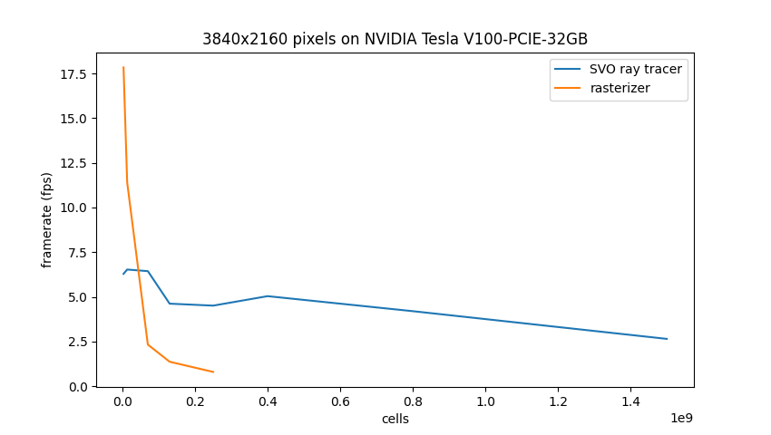

# AMR-view

https://github.com/user-attachments/assets/bfdd92e9-6e41-4b5b-a9c7-7997f4bf2c3a

---

GPU-accelerated volume renderer for large particle/AMR (Adaptive Mesh Refinement) datasets. Renders fly-through videos along a camera path using Vulkan compute ray tracing through a Sparse Voxel Octree (SVO).

Since `amr-view` relies entirely on compute shaders rather than a traditional rasterization pipeline, it can run headlessly on server-grade hardware (e.g., NVIDIA H100) without a display attached.

## How It Works

The renderer processes datasets by representing each data point as a leaf node in a custom SVO. Frame generation happens in a two-stage pipeline:

### Stage 1: Depth Accumulation
For each pixel, a ray is cast from the camera origin. As the ray traverses the SVO, it accumulates column density and weight across every intersected leaf node using the following formulas:

$$ray\_{qty} += \frac{qty \cdot w}{dx^2} \cdot dt$$

$$ray\_w += \frac{w}{dx^2} \cdot dt$$

Where:
* $qty$: The cell's quantity field
* $w$: The cell's weight
* $dx$: The cell's edge length
* $dt$: The distance the ray travels through the voxel

### Stage 2: Tone Mapping
Once the ray exits the root node, the depth-weighted mean of the quantity field is calculated using a base-10 logarithm:

$$\log_{10}\left(\frac{ray\_{qty}}{ray\_w}\right)$$

This value is mapped through a user-specified 256-color RGBA colormap (supporting custom underflow, overflow, and error colors) and written to the final frame.

## Data format

### Dataset format (`.amrv`)

The renderer expects a binary file composed of a version-specific metadata header followed by a compact SVO ([Sparse Voxel Octree](https://eisenwave.github.io/voxel-compression-docs/svo/svo.html)). You can generate this using the [create_cutout_svo.py](./tools/create_cutout_svo.py) script.

Each SVO node is exactly **8 bytes** and can be one of two types:
* **Branch Node:** Two 32-bit integers. The first is the index of the first child node; the second is a bit-mask indicating child presence and whether they are leaves.
* **Leaf Node:** Two 32-bit single-precision floats. The first is the quantity field; the second is the weight.

### Camera path format

A plain text file where each line defines a camera state using 9 space-separated floats: `px py pz cx cy cz nx ny nz` (Position, Direction vector, and Up vector).

### Colormap format

A binary file containing 256 structural RGBA byte-quartets (1024 bytes total). You can generate compatible colormaps from matplotlib profiles using the following [python script](./tools/create_colormap.py). You can also make your own whacky one :).

## Dependencies / Requirements

### Build dependencies

- [Zig Compiler](https://ziglang.org/learn/getting-started/) (v0.16.0 or compatible)

    - MacOS : `brew install zig`
    - Arch Linux : `sudo pacman -S zig`
    - Fedora / RHEL : `sudo dnf install -y zig`
    - Ubuntu / Debian : `sudo apt install zig`

### Runtime dependencies

- A working [Vulkan](https://www.vulkan.org/) driver (v1.2 or later)
    - MacOS : `brew install molten-vk`
    - Arch Linux : [see here](https://wiki.archlinux.org/title/Vulkan)
    - Fedora / RHEL : [see here](https://rpmfusion.org/Howto/NVIDIA#Vulkan)
    - Ubuntu / Debian : [see here](https://oneuptime.com/blog/post/2026-03-02-how-to-install-and-configure-vulkan-on-ubuntu/view#installing-vulkan-packages)
    > Installing Vulkan might require more setup if you have an NVIDIA card.

- [FFmpeg](https://www.ffmpeg.org/) installed and on `PATH`.
    - MacOS : `brew install ffmpeg`
    - Arch Linux : `sudo pacman -S ffmpeg`
    - Fedora / RHEL : `sudo dnf install -y ffmpeg` 
    - Ubuntu / Debian : `sudo apt install ffmpeg`

## Installation

### Download binaries

Pre-compiled executables for major platforms are available on the [releases](https://github.com/stuvw/amr-view/releases) page.

### Build from source
```bash

git clone https://github.com/stuvw/amr-view.git
cd amr-view
zig build -Doptimize=ReleaseFast
```

The binary will be generated at `./zig-out/bin/amr-view` .

## Usage

### Command example

```bash
./amr-view --data-file ./examples/Obelisk_small.amrv \
           --path-file ./examples/path_circle.txt \
           --colormap-file ./examples/inferno.cmap \
           --video-file ./examples/export.mkv \
           --framerate 30
```


### Full argument reference

| Argument | Default | Description |
| -------- | ------- | ----------- |
| --data-file | *required* | Input SVO file |
| --path-file | *required* | Input camera path file |
| --colormap-file | *required* | Input colormap file |
| --video-file | video.mp4 | Output video file |
| --width | 1920 | Output video width |
| --height | 1080 | Ouput video height |
| --fov | 60 | Ouput video FOV |
| --framerate | 60 | Output video frame rate |
| --min-val | -3.0 | Underflow value |
| --max-val | 3.0 | Overflow value |
| --under-color | 0,0,0,1 | RGBA color used when the value underflows --min-val |
| --over-color | 1,1,1,1 | RGBA color used when the value overflows --max-val |
| --bad-color | 0,0,0,0 | RGBA color used when a rendering error occurs |
| --root-size | 1.0 | Edge size of the root node of the SVO |
| --root-pos | 0,0,0 | Center position of the root of the SVO |
| --encoder | x264 | Video codec used to encode the output video. Choices: x264, x265, av1 |
| --hwaccel | none | Use GPU hardware video acceleration. GPU must support requested encoder. Choices: none, nvenc, amf, qsv, vtb |
| --mode | normal | Select rendering mode. Choices: normal, vr180, vr360 |

## Roadmap (Coming soon™)

 - TBD, will consider user requests

## Performance



<br>

The [rasterizer](https://github.com/stuvw/RenderPath/) quickly gets bottlenecked by the fixed-function rasterization hardware, and fails to render past 4 GiB files, due to a design limitaion.

Meanwhile, the current approach stays quite steady up to around a billion cells, and performance slowly decreases. Currently, the code supports a maximum file size of 64 GiB, but it would be possible to push that limit back even further.

## VR 180/360

It is possible to render headset VR360 and dome VR180 video using the `--mode` flag. In most cases, VR360 video is expected to be in a 2:1 width:height format, whereas VR180 is expected to be 1:1.

## Credits / Thanks

- Stéphane Rouberol for his recurrent help
- Corentin Cadiou, designed original rasterization renderer, co-investigator of the Megatron simulation 
- Maxime Trebitsch, primary investigator of the Obelisk simulation
- San Han, primary investigator the New Cluster simulation
- Yohan Dubois, primary investiagtor of the New Horizon simulation
- Christophe Pichon, co-investiagtor of the New Horizon simulation
